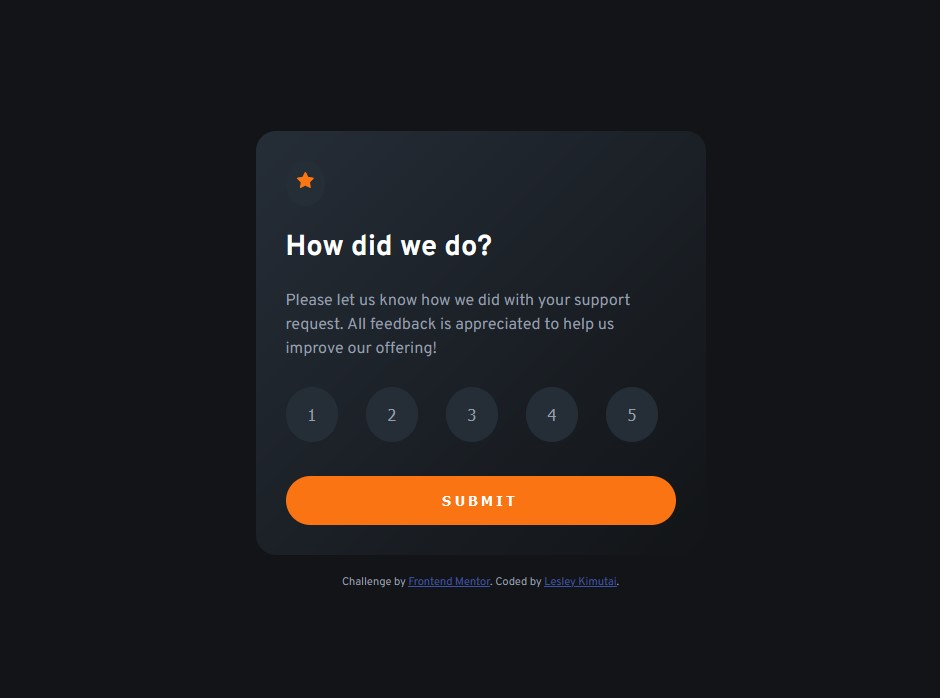
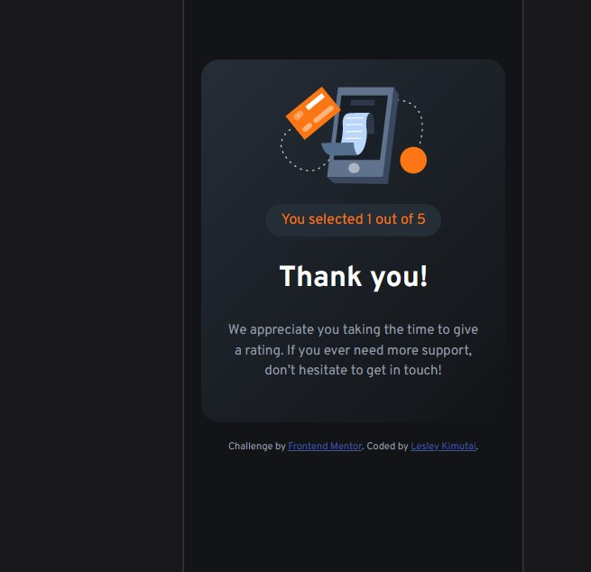

# Frontend Mentor - Interactive rating component solution

This is a solution to the [Interactive rating component challenge on Frontend Mentor](https://www.frontendmentor.io/challenges/interactive-rating-component-koxpeBUmI). Frontend Mentor challenges help you improve your coding skills by building realistic projects.

## Table of contents

- [Overview](#overview)
  - [The challenge](#the-challenge)
  - [Screenshot](#screenshot)
  - [Links](#links)
- [My process](#my-process)
  - [Built with](#built-with)
  - [What I learned](#what-i-learned)
- [Author](#author)

## Overview

### The challenge

Users should be able to:

- View the optimal layout for the app depending on their device's screen size
- See hover states for all interactive elements on the page
- Select and submit a number rating
- See the "Thank you" card state after submitting a rating

### Screenshot

Laptop and Tablet layout :-



Mobile and smaller screens view :-



### Links

- Solution URL: [Github Link](https://github.com/issagoodlifeInc/Rating-Component.git)
- Live Site URL: [Interactive Rating Component](https://issagoodlife-rating.netlify.app/)

## My process

- Started with HTML markup
- Then styled the sections with a mobile first approach
- Finaly added js for functionality

### Built with

- Semantic HTML5 markup
- CSS custom properties
- CSS Grid
- Mobile-first workflow

### What I learned

Some code I'm proud of : -
Rerenders the ratings page after 6s and initializes `yourRate` to an empty string so that clicking submit doesnt show the thank you section

```js
setTimeout(() => {
  ratingSection.style.display = "block";
  thanksSection.style.display = "none";
  rateBtns.forEach((btn) => btn.classList.remove("selected"));
  yourRate = "";
}, 6000);
```

## Author

- Twitter - [@KimutaiLesley](https://www.twitter.com/KimutaiLesley)
